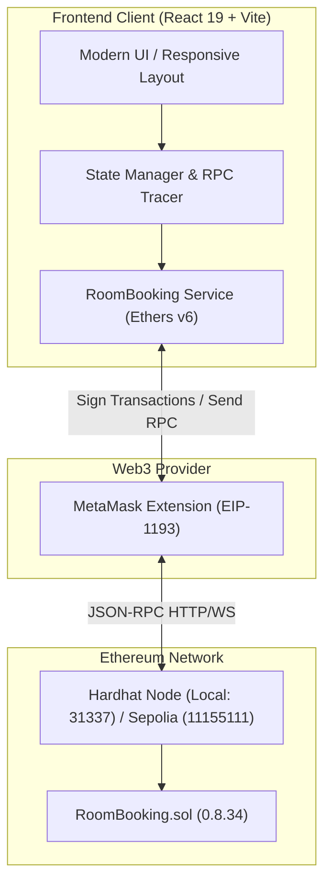

# 🏨 StayLedger — Decentralized Hotel Room Booking DApp

[](https://soliditylang.org/)
[](https://hardhat.org/)
[](https://react.dev/)
[](https://vitejs.dev/)
[](https://docs.ethers.org/v6/)
[](LICENSE)

**StayLedger** is a full-stack Web3 hotel and room booking decentralized application (DApp) running on Ethereum. It replaces centralized reservation databases with an immutable Solidity smart contract, allowing guests to check room availability in real time, reserve fixed 2-hour slots up to 3 days in advance, batch-book multiple rooms in a single atomic transaction, and cancel bookings with automated on-chain Ether refunds.

---

## 📑 Table of Contents

- [Overview & Architecture](#-overview--architecture)
- [Key Features](#-key-features)
- [Smart Contract Specification](#-smart-contract-specification)
  - [Booking Slot Rules](#booking-slot-rules)
  - [Contract Interface & Functions](#contract-interface--functions)
  - [Custom Errors & Events](#custom-errors--events)
- [Project Structure](#-project-structure)
- [Prerequisites](#-prerequisites)
- [Quick Start (Automated PowerShell Scripts)](#-quick-start-automated-powershell-scripts)
- [Manual Setup (Cross-Platform)](#-manual-setup-cross-platform)
  - [1. Blockchain Setup & Local Node](#1-blockchain-setup--local-node)
  - [2. Deploy the Smart Contract](#2-deploy-the-smart-contract)
  - [3. Frontend Setup & Configuration](#3-frontend-setup--configuration)
- [MetaMask Configuration](#-metamask-configuration)
- [Sepolia Testnet Deployment](#-sepolia-testnet-deployment)
- [Testing](#-testing)
- [Environment Variables](#-environment-variables)
- [Troubleshooting](#-troubleshooting)

---

## 🏛 Overview & Architecture

StayLedger connects a React 19 single-page application to an Ethereum smart contract (`RoomBooking.sol`) via Ethers.js v6 and the browser's MetaMask provider.



### Key Workflow
1. **Discovery**: The frontend queries `roomCount()`, `rooms(id)`, and slot availability via `isSlotAvailable(roomId, slotId)`.
2. **Booking**: The user selects one or more room slots and triggers `bookRooms()` (or `bookRoom()`). MetaMask prompts for signature with the exact ETH payment required.
3. **Receipt & Gas Reporting**: The application confirms the block inclusion and displays an interactive gas toast notification with the actual gas used and fee paid.
4. **Cancellation**: Guests can view their active reservations via `getUserBookings(address)` and trigger `cancelBooking()` to immediately receive an ETH refund.

---

## ✨ Key Features

- **🕒 Fixed 2-Hour Scheduling Matrix**: Rooms are booked in predetermined 2-hour slots starting at `09:00 UTC` with a 3-day advance booking horizon (6 distinct slots per day: 09:00, 11:00, 13:00, 15:00, 17:00, and 19:00 UTC).
- **🛒 Atomic Batch Booking**: Reserve multiple rooms and time slots simultaneously in a single transaction via `bookRooms()`. If any slot is occupied or payment is insufficient, the entire transaction reverts cleanly.
- **⛽ Live Gas Estimation & Toast Notifications**: Pre-calculates gas requirements using `estimateGas` prior to transaction submission and displays a floating gas alert (`GasNotification`) with gas units consumed and ETH cost upon completion.
- **💸 Automated On-Chain Refunds**: Active reservations can be cancelled at any time by the guest via `cancelBooking()` or `cancelBookings()`, which resets slot availability and refunds the full room price back to the guest's wallet via low-level call.
- **🛡️ Custom Revert Error Handling**: Solves generic revert messages by decoding custom Solidity errors (`SlotUnavailable`, `IncorrectPayment`, `InvalidRoom`, `InvalidSlot`, `MaxRoomsReached`, `NotGuest`, `TransferFailed`) into human-readable UI alerts.
- **🌐 In-App Multi-Network Switching**: Toggle between `Hardhat Local` (`31337`) and `Sepolia` (`11155111`) with automatic `wallet_switchEthereumChain` and `wallet_addEthereumChain` RPC calls.
- **🛠️ Integrated Room Creation**: Includes an administrative/testing form to register new rooms with custom ETH pricing directly on-chain (contract enforces a limit of 4 rooms).
- **🔎 Built-in RPC Call Tracing**: Detailed console tracing for developers, logging method names, selectors, decoded arguments, and contract bytecodes.

---

## 📜 Smart Contract Specification

The core contract is [`RoomBooking.sol`](file:///hotel-booking/blockchain/contracts/RoomBooking.sol) written in Solidity `^0.8.34`.

### Booking Slot Rules

| Parameter | Value | Description |
| :--- | :--- | :--- |
| `BOOKING_DURATION` | `2 hours` | Duration of each booking slot |
| `MAX_ADVANCE` | `3 days` | Maximum advance booking window |
| `FIRST_SLOT_HOUR` | `9 hours` | Daily schedule start (09:00 UTC) |
| `SLOT_INTERVAL` | `2 hours` | Interval between slots |
| `SLOT_COUNT` | `6` | 6 slots/day (09:00, 11:00, 13:00, 15:00, 17:00, 19:00 UTC) |
| `Max Rooms` | `4` | Hard-capped inventory limit |

### Data Structures

```solidity
struct Room {
    string name;       // Name of the room
    uint256 price;     // Price per 2-hour slot (in wei)
    bool exists;       // Existence indicator
}

struct Booking {
    uint256 id;        // Unique booking ID
    address guest;     // Guest wallet address
    uint256 roomId;    // ID of the booked room
    uint256 startTime; // Unix timestamp of slot start
    uint256 amount;    // Payment amount (wei)
    bool active;       // Status flag (false if cancelled)
}
```

### Contract Interface & Functions

| Function | Type | Payable | Description |
| :--- | :--- | :---: | :--- |
| `addRoom(string name, uint256 price)` | External | No | Adds a new room with given name and price (max 4 rooms). |
| `bookRoom(uint256 roomId, uint256 startTime)` | External | **Yes** | Books a single 2-hour slot for a room. Requires exact ETH payment. |
| `bookRooms(uint256[] roomIds, uint256[] startTimes)` | External | **Yes** | Atomically books multiple room slots in a single transaction. |
| `cancelBooking(uint256 roomId, uint256 slotId)` | External | No | Cancels an active booking, reopens the slot, and refunds ETH to guest. |
| `cancelBookings(uint256[] roomIds, uint256[] slotIds)` | External | No | Batch cancellation and refund of multiple reservations. |
| `isSlotAvailable(uint256 roomId, uint256 slotId)` | External View | No | Returns `true` if the room exists and slot is unreserved. |
| `isValidSlot(uint256 startTime)` | External View | No | Validates slot boundaries, interval, and advance window. |
| `getUserBookings(address guest)` | External View | No | Returns an array of booking IDs associated with a guest address. |
| `getBooking(uint256 roomId, uint256 slotId)` | External View | No | Retrieves booking details for a given room and slot. |
| `getBookingById(uint256 bookingId)` | External View | No | Retrieves booking details by unique booking ID. |

### Custom Errors & Events

- **Custom Errors**:
  - `InvalidRoom()`: Room does not exist.
  - `InvalidSlot()`: Slot is out of bounds, in the past, or misaligned with the 2-hour schedule.
  - `SlotUnavailable()`: Slot is already booked or reservation is inactive.
  - `IncorrectPayment()`: Sent ETH (`msg.value`) does not match room price (or total sum).
  - `NotGuest()`: Caller is not the creator of the reservation.
  - `TransferFailed()`: Low-level ETH refund transfer failed.
  - `MaxRoomsReached()`: Attempted to add more than 4 rooms.
- **Events**:
  - `RoomAdded(uint256 indexed roomId, string name, uint256 price)`
  - `RoomBooked(uint256 indexed roomId, uint256 indexed slotId, address indexed guest, uint256 startTime, uint256 amount)`
  - `BookingCancelled(uint256 indexed roomId, uint256 indexed slotId, address indexed guest)`

---

## 📁 Project Structure

```plaintext
spn/
├── hotel-booking/
│   ├── blockchain/                     # Smart contracts & Hardhat environment
│   │   ├── contracts/
│   │   │   ├── RoomBooking.sol         # Main Hotel Booking smart contract
│   │   │   ├── Counter.sol             # Starter reference contract
│   │   │   └── Counter.t.sol           # Foundry-compatible test
│   │   ├── scripts/
│   │   │   ├── deploy.js               # Deployment script (saves artifact & deployments/*.json)
│   │   │   └── send-op-tx.ts           # Optimism simulation test script
│   │   ├── test/
│   │   │   ├── RoomBooking.ts          # Comprehensive Mocha/Ethers test suite
│   │   │   └── Counter.ts              # Unit tests for Counter
│   │   ├── deployments/                # Stored deployment metadata per chainId
│   │   ├── hardhat.config.ts           # Hardhat 3 configuration (Solidity 0.8.34, networks)
│   │   ├── package.json
│   │   └── .env.example
│   │
│   └── frontend/                       # React 19 + Vite web client
│       ├── public/                     # Static SVG assets & icons
│       ├── src/
│       │   ├── assets/                 # Graphics (hero banner, React/Vite logos)
│       │   ├── components/
│       │   │   └── GasNotification.jsx # Live floating toast for gas metrics
│       │   ├── config/
│       │   │   ├── networks.js         # Supported networks (Hardhat Local, Sepolia)
│       │   │   └── roomBooking.js      # Contract ABI loader
│       │   ├── services/
│       │   │   └── roomBooking.js      # Ethers.js integration, RPC tracing, errors
│       │   ├── App.css                 # Custom responsive stylesheet
│       │   ├── App.jsx                 # Core booking application component
│       │   ├── index.css
│       │   └── main.jsx
│       ├── index.html
│       ├── vite.config.js
│       ├── package.json
│       └── .env.example
│
├── setup.ps1                           # Automated local dev bootstrapper (PowerShell)
├── reset_bc.ps1                        # Blockchain state reset & redeploy script (PowerShell)
└── README.md                           # Project documentation
```

---

## 💻 Prerequisites

Ensure you have the following installed on your machine:

1. **[Node.js](https://nodejs.org/)** (v18.0.0 or later, v20+ recommended)
2. **[npm](https://www.npmjs.com/)** (comes with Node.js)
3. **[MetaMask](https://metamask.io/)** browser extension installed in Chrome, Brave, Firefox, or Edge.
4. *(Windows Users)* **PowerShell 5.1+ or PowerShell 7+** to use the automated launch scripts.

---

## ⚡ Quick Start (Automated PowerShell Scripts)

On Windows, you can start the entire local environment with one command.

### 1. Launch Everything
Run [`setup.ps1`](file:///setup.ps1) from the project root:

```powershell
.\setup.ps1
```

**What this script does automatically**:
1. Spawns a dedicated PowerShell window running `npx hardhat node` on `http://127.0.0.1:8545`.
2. Waits until the RPC port `8545` responds.
3. Compiles and deploys [`RoomBooking.sol`](file:///hotel-booking/blockchain/contracts/RoomBooking.sol) using `scripts/deploy.js`.
4. Extracts the newly deployed contract address.
5. Updates `hotel-booking/frontend/.env` with `VITE_CONTRACT_ADDRESS_LOCAL=<address>`.
6. Spawns a second window running `npm run dev` to launch the Vite frontend server.

### 2. Reset Blockchain State
If you want to clear contract storage and deploy a fresh contract instance:

```powershell
.\reset_bc.ps1
```

This clears the Hardhat build cache, recompiles contracts, relaunches the node, redeploys the contract, and updates `.env`.

---

## 🛠 Manual Setup (Cross-Platform)

For Linux, macOS, or manual Windows development:

### 1. Blockchain Setup & Local Node

Open a terminal and navigate to the blockchain directory:

```bash
cd hotel-booking/blockchain

# Install dependencies
npm install

# Compile contracts
npx hardhat compile

# Run the test suite to verify everything passes
npx hardhat test

# Start the local Hardhat JSON-RPC node (runs on http://127.0.0.1:8545, chainId 31337)
npx hardhat node
```

*Keep this terminal window running.* The terminal will display 20 pre-funded test accounts with 10,000 ETH each and their corresponding private keys.

### 2. Deploy the Smart Contract

Open a **new terminal** and run the deployment script targeting `localhost`:

```bash
cd hotel-booking/blockchain
npx hardhat run scripts/deploy.js --network localhost
```

Example output:
```plaintext
Deploying from 0xf39Fd6e51aad88F6F4ce6aB8827279cffFb92266
Network: localhost
Chain ID: 31337
Deployed contract address: 0x5FbDB2315678afecb367f032d93F642f64180aa3
Saved deployment: deployments/31337.json
```

Copy the printed contract address.

### 3. Frontend Setup & Configuration

Open a **new terminal** and configure the frontend:

```bash
cd hotel-booking/frontend

# Install dependencies
npm install

# Create .env file from the template
cp .env.example .env
```

Open `.env` in `hotel-booking/frontend/` and set the contract address:
```env
VITE_CONTRACT_ADDRESS_LOCAL=0x5FbDB2315678afecb367f032d93F642f64180aa3
```

Start the Vite development server:
```bash
npm run dev
```

Open your browser and navigate to the local URL (typically **`http://localhost:5173`**).

---

## 🦊 MetaMask Configuration

To interact with the local blockchain in your browser:

### 1. Add Hardhat Local Network to MetaMask
- Open **MetaMask** -> Settings -> Networks -> **Add Network Manually**.
- **Network Name**: `Hardhat Local`
- **New RPC URL**: `http://127.0.0.1:8545`
- **Chain ID**: `31337`
- **Currency Symbol**: `ETH`

> **Note**: The frontend also provides a **"Switch Network"** button that automatically issues `wallet_addEthereumChain` / `wallet_switchEthereumChain` requests to MetaMask.

### 2. Import a Test Account
1. Copy one of the private keys output by `npx hardhat node` (e.g. Account #0: `0xac0974bec39a17e36ba4a6b4d238ff944bacb478cbed5efcae784d7bf4f2ff80`).
2. In MetaMask, click the account dropdown -> **Add account or hardware wallet** -> **Import account**.
3. Paste the private key. You will now have 10,000 test ETH available for testing bookings.

---

## 🚀 Sepolia Testnet Deployment

To deploy StayLedger to Ethereum's public Sepolia testnet:

### 1. Configure Blockchain Environment
Create `.env` in `hotel-booking/blockchain/`:
```env
SEPOLIA_RPC_URL=https://sepolia.infura.io/v3/YOUR_INFURA_PROJECT_ID
PRIVATE_KEY=your_deployer_wallet_private_key_with_sepolia_eth
```

### 2. Deploy to Sepolia
```bash
cd hotel-booking/blockchain
npx hardhat run scripts/deploy.js --network sepolia
```

### 3. Configure Frontend for Sepolia
In `hotel-booking/frontend/.env`:
```env
VITE_ROOM_BOOKING_SEPOLIA_ADDRESS=0xYourSepoliaContractAddress
VITE_SEPOLIA_RPC_URL=https://sepolia.infura.io/v3/YOUR_INFURA_PROJECT_ID
```

You can now toggle the network dropdown in the StayLedger UI to **Sepolia** and click **Switch Network**.

---

## 🧪 Testing

The blockchain repository contains a comprehensive suite of unit and integration tests covering:
- Single & batch slot reservations
- Advance booking window validations (3-day limit)
- Slot alignment checks (2-hour fixed slots)
- Duplicate slot prevention and payment correctness
- Maximum room ceiling (enforces limit of 4 rooms)
- Cancellation handling and exact Ether refund verification

Run the tests using:
```bash
cd hotel-booking/blockchain
npm test
```

Expected output:
```plaintext
Running Solidity tests
  ✔ test_InitialValue()
  ✔ test_IncByZero()
  ✔ testFuzz_Inc(uint8) (runs: 256)

Running Mocha tests
  RoomBooking
    ✔ books a fixed two-hour slot and stores a user-indexed booking record
    ✔ keeps multiple reservations for the same wallet
    ✔ books multiple room slots in one transaction
    ✔ allows at most four rooms
    ✔ rejects a duplicate slot and incorrect payment
    ✔ allows only fixed slots within the three-day booking window
    ✔ allows a valid slot earlier today
    ✔ cancels a booking, refunds the guest, and releases the slot

  13 passing
```

To run lint checks on the frontend:
```bash
cd hotel-booking/frontend
npm run lint
```

---

## 🔐 Environment Variables

### Blockchain (`hotel-booking/blockchain/.env`)
| Variable | Description | Example |
| :--- | :--- | :--- |
| `SEPOLIA_RPC_URL` | HTTPS RPC endpoint for Sepolia network | `https://eth-sepolia.g.alchemy.com/v2/...` |
| `PRIVATE_KEY` | Hex-encoded private key for deployment | `0x123abc...` |

### Frontend (`hotel-booking/frontend/.env`)
| Variable | Description | Example |
| :--- | :--- | :--- |
| `VITE_CONTRACT_ADDRESS_LOCAL` | Deployed address on Hardhat local node | `0x5FbDB2315678afecb367f032d93F642f64180aa3` |
| `VITE_ROOM_BOOKING_SEPOLIA_ADDRESS` | Deployed address on Sepolia testnet | `0x1234567890123456789012345678901234567890` |
| `VITE_SEPOLIA_RPC_URL` | Optional public/custom RPC for Sepolia | `https://rpc.sepolia.org` |

---

## ❓ Troubleshooting

### 1. MetaMask Nonce / Transaction Replaced Error
If you restarted the local Hardhat node (`setup.ps1` or `reset_bc.ps1`), MetaMask may still cache transaction nonces from the previous chain state.
- **Fix**: In MetaMask, go to **Settings** -> **Advanced** -> **Clear activity tab data** (or "Reset account"). This will synchronize MetaMask's nonce counter with the fresh blockchain.

### 2. "No contract address is configured for Hardhat Local"
- Ensure `hotel-booking/frontend/.env` contains `VITE_CONTRACT_ADDRESS_LOCAL=<deployed_address>`.
- Restart the Vite development server (`npm run dev`) after changing `.env`.

### 3. "SlotUnavailable" Revert
- The selected slot has already been booked by another transaction. Select a different slot or cancel the existing reservation.

### 4. "MaxRoomsReached" Revert
- The `RoomBooking` contract has a built-in safety limit of 4 rooms maximum (`roomCount >= 4`). To add different rooms, reset the local blockchain using `reset_bc.ps1`.

---

## 📄 License

This project is licensed under the [MIT License](LICENSE).
